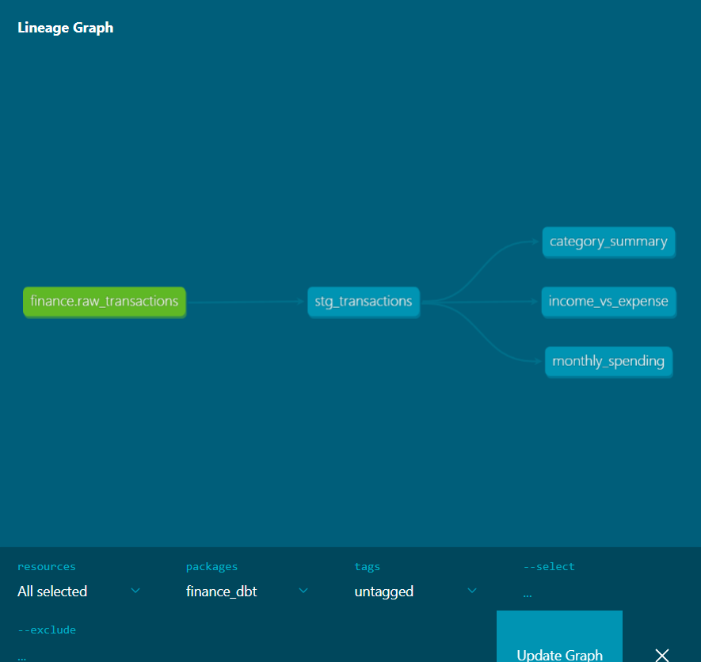
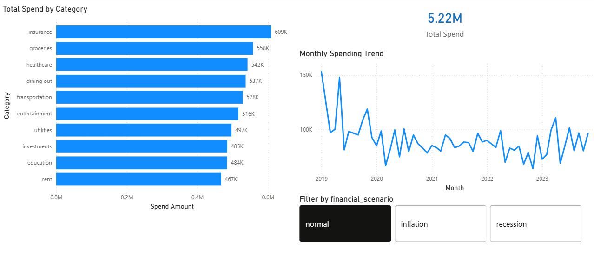
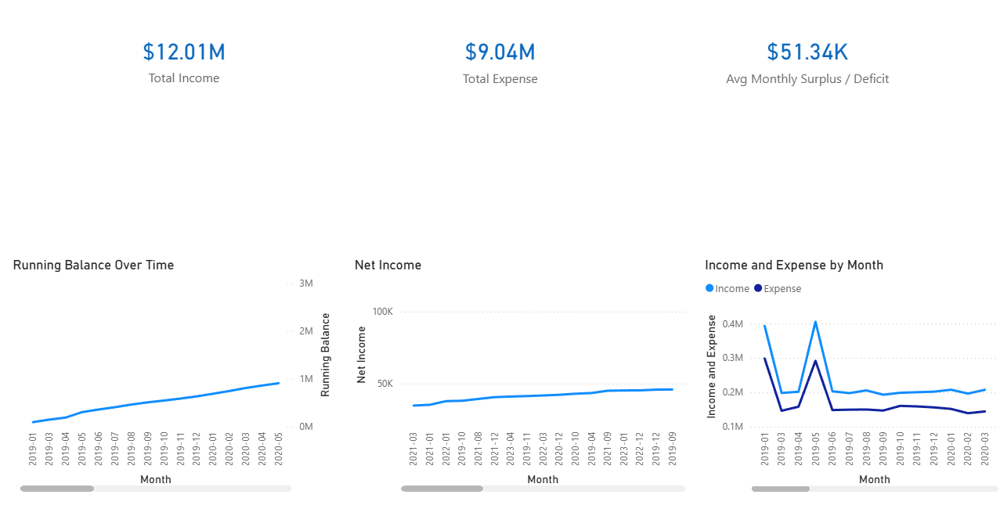

# Finance Analytics Pipeline
## About
This project demonstrates a complete analytics engineering workflow built 
to showcase SQL, Python, dbt, and Power BI skills for data analyst and 
analytics engineer roles. It ingests synthetic personal finance data, 
applies data quality checks, models it using dbt, and visualizes insights 
in Power BI. 

## Tech Stack
- Python (pandas, SQLAlchemy)
- PostgreSQL
- dbt Core
- Power BI
- Git / GitHub

## Project Architecture
Raw CSV → Python Cleaning → PostgreSQL → dbt Models → Power BI Dashboard

## Lineage Graph


## Dashboard
### Spending Overview


### Income vs Expense


## Setup Instructions
### 1. Clone the repo
```bash
git clone https://github.com/CodeMorera/finance-analytics-pipeline.git
```

### 2. Create and activate virtual environment
```bash
python -m venv venv
source venv/Scripts/activate
```

### 3. Install dependencies
```bash
pip install -r requirements.txt
```

### 4. Create a .env file in the root folder with:
DB_USER=your_username
DB_PASSWORD=your_password
DB_HOST=localhost
DB_PORT=5432
DB_NAME=finance_db

### 5. Run the pipeline
```bash
python src/clean.py
python src/load.py
```

### 6. Run dbt models
```bash
cd finance_dbt
dbt run
dbt test
```
## Data Source
Synthetic personal finance dataset from Kaggle — 3,000 records spanning 
2019–2023 across normal, inflation, and recession economic scenarios. 
100% privacy-safe synthetic data.

## Build Progress
- [x] Week 1 — Repo setup and project structure
- [x] Week 2 — Data cleaning with Python and pandas
- [x] Week 3 — PostgreSQL loading with row count assertions
- [x] Week 4 — dbt staging model and source configuration
- [x] Week 5 — dbt mart models with window functions
- [x] Week 6 — 23 passing data quality tests and lineage documentation
- [x] Week 7 — Power BI dashboard with spending and income analysis
